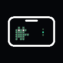

<!-- Modified by lihao505 for Agent Notch, 2026. -->
<div align="center">
  
  <h1>Agent Notch</h1>
  <p>在 MacBook 刘海中统一查看、切换和处理本地 AI 编程任务。</p>

  [](https://github.com/lihao505/agent-notch/actions/workflows/ci.yml)
  [](LICENSE.md)
</div>

Agent Notch 是一个本地优先的 macOS 工具，当前主要面向 Claude Code 与 Codex。
它会根据任务数量调整刘海尺寸，并提供会话标题、用量、对话跳转、Codex 回复和
逐会话审批策略。**CodeBuddy 集成目前标记为 Experimental**：仓库已经包含观察
Bridge 与 CLI 续接适配，但尚未完成真实完整回合验收，不应视为稳定兼容承诺。

## 项目状态

当前版本是开源预览版，优先提供源码构建，不提供经过 Developer ID 签名和 Apple
公证的官方安装包。直接分享自行构建的 App 时，macOS 可能提示无法验证开发者。

Claude Code、Codex 和 CodeBuddy 的协议会随各自版本变化。审批与自动信任功能仍
需在对应工具的真实版本上逐项验收；不要在未确认兼容性时将其视为安全边界。
CodeBuddy 在完成发布清单中的真实会话验收前始终保持 Experimental 标识。

## 当前能力

- 自适应小刘海：空闲、工作、等待审批和完成状态使用不同像素动画
- 多任务视图：只保留正在运行的项目，完成项目在保留期后自动清理
- 会话导航：Codex 任务可切换到对应桌面对话，Claude/CLI 会话可聚焦所属终端
- 刘海内交互：查看聊天记录、向 Codex 继续发送消息、批准或拒绝工具请求
- 逐会话审批：单次审批、自动审批、完全信任；默认仍为单次审批
- 本地设置：中英文、常驻/智能隐藏、简略/详细、尺寸和动画预览
- 本地优先：不包含产品分析 SDK，不上传会话遥测

## 系统要求

- 带刘海的 MacBook（无刘海屏幕可以运行，但不是主要适配目标）
- macOS 15.5 或更高版本
- Xcode 16 或更高版本（仅源码构建需要）
- 至少安装一个受支持的 Agent CLI

## 源码构建

```bash
git clone https://github.com/lihao505/agent-notch.git
cd agent-notch
xcodebuild \
  -project ClaudeIsland.xcodeproj \
  -scheme ClaudeIsland \
  -configuration Debug \
  -destination 'platform=macOS' \
  CODE_SIGNING_ALLOWED=NO \
  build
```

内部 Xcode scheme 暂时保留 `ClaudeIsland`，这是上游兼容性技术标识，不是产品名。
生成的应用、Bundle ID 和公开品牌均为 Agent Notch。

首次引导中只有明确选择“启用并开始”后，应用才会安装随包附带的
`AgentBridge`；选择跳过不会修改任何 Agent 配置。Claude 使用原生 Hook，Codex 使用
观察 Bridge；CodeBuddy 的观察 Bridge 属于 Experimental 接入。也可在源码目录手动执行：

```bash
./AgentBridge/install.sh
```

安装器会先备份配置，并只按完整命令移除自己管理的条目。详细冲突策略、调试方法与
卸载方式见 [AgentBridge/README.md](AgentBridge/README.md)。

## Hook 与审批安全

应用只会精确识别并管理自己安装的 Claude Hook，不会按文件名子串删除第三方配置。
观察类 Hook 可以共存；会返回 allow/deny 的 `PermissionRequest` Hook 必须只有一个
决策所有者。检测到其他决策 Hook 时，集成安装器默认跳过审批接管。

自动审批和完全信任仅作用于普通 Agent 工具请求，不会代替 macOS 系统授权、外部
账户授权、问答选择或计划确认。真实协议兼容性会在每个支持的 Agent 版本上单独验收。

## 隐私

Agent Notch 默认在本机读取 Agent 会话文件并通过本机 Unix socket 接收 Hook 事件。
网络访问仅来自用户使用的 Agent 工具，以及配置完成后的更新检查。详见
[PRIVACY.md](PRIVACY.md)。

## 开源与贡献

- 开源发布清单与可选签名流程：[docs/RELEASE_CHECKLIST.md](docs/RELEASE_CHECKLIST.md)
- Agent 接入层：[AgentBridge/README.md](AgentBridge/README.md)
- 安全问题：[SECURITY.md](SECURITY.md)
- 贡献指南：[CONTRIBUTING.md](CONTRIBUTING.md)
- 第三方许可：[THIRD_PARTY_NOTICES.md](THIRD_PARTY_NOTICES.md)
- 素材来源：[docs/ASSET_PROVENANCE.md](docs/ASSET_PROVENANCE.md)

## 独立项目说明

Agent Notch 是独立维护的衍生项目，与 Apple、Anthropic、OpenAI、Vibe Notch 或
其他 Agent 厂商没有官方关系。Claude、Codex、CodeBuddy 等名称只用于兼容性说明，
相关商标归各自权利人所有。

本项目基于 Apache-2.0 许可的软件继续开发，保留原始许可证和 NOTICE。详见
[LICENSE.md](LICENSE.md) 与 [NOTICE](NOTICE)。
